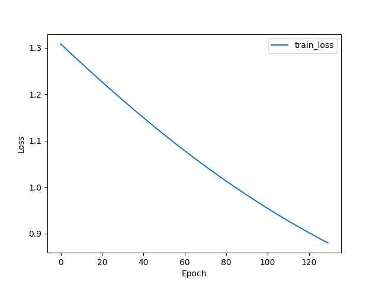
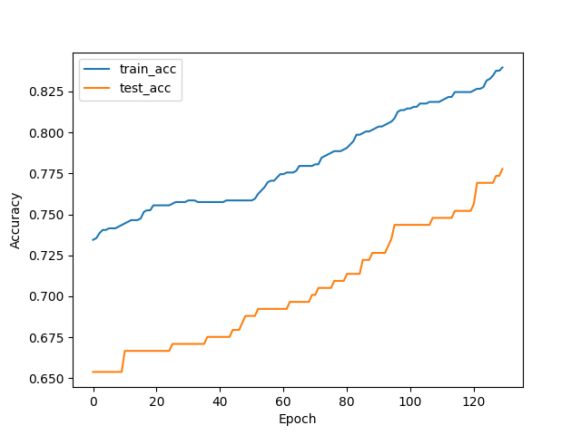

# KEIT KT with Learning Factors

(Pytorch implementation)  
지식추적 모델 구현 담당자 : 박우석 연구원, 박나연 연구원

학생 로그 데이터, 각 topic 의 Knowledge Concepts(KC) 를 활용하여 시간 T에서의 학생 u에 대한 각 KC에서의 지식 상태를 학습.

학습된 지식 상태 U 를 바탕으로, 전이 학습을 통해 Learning Factors (Learning Factor + Forget Factor) 의 학생별 가중치 $\alpha$ 를 학습.

## Model Reference 
Learning Factors Knowledge Tracing Model Based on Dynamic Cognitive Diagnosis, Liping Zhang, 2021
[Paper Link](https://onlinelibrary.wiley.com/doi/10.1155/2021/8777160)

## Version
V0.1.0 : TEST ACC 0.77 (released on 2024-11-08)

## Environments
requirements.txt 참조 

## How to Use
`python ktlf.py`

## Results  
TEST Accuracy 0.77 달성 

**train loss & accuracy**

